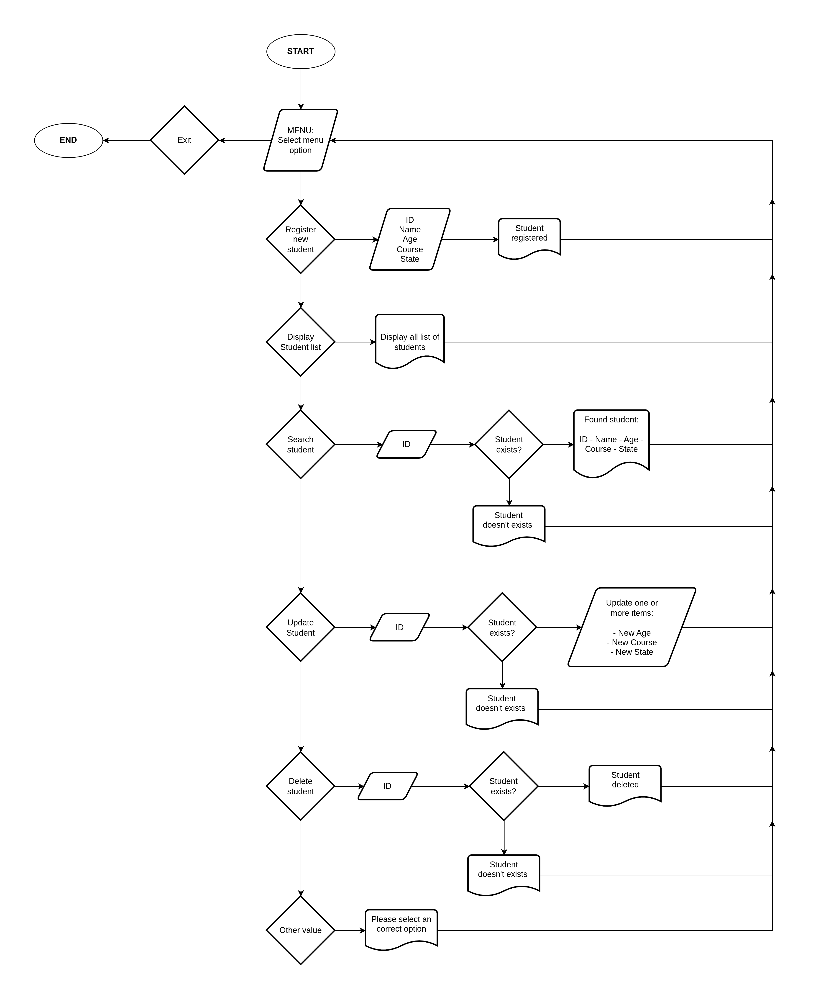

## J-STUDENT REGISTRITATION SYSTEM

### ✅ Description

This project implements a simple student registration System for a school called J-STUDENT.

It allows users to add students, display the current student list, update and delete any student.

The system is a console-based application, designed to work directly in the terminal without using external databases or files.

### ✅ Flow diagram

### ✅ Instructions for running the program

1. Make sure you have Python 3 installed on your computer.

2. Download or clone all the project files into a single folder.

3. Open a terminal and navigate to the project directory.

4. Run the program with the following command:

        python main.py

5. Use the menu options by entering the corresponding number:

        1. Register student
        2. Display student list
        3. Search student
        4. Update student
        5. Delete student
        6. Exit

### ✅ Data structures used

The student list is stored as a list where each element represents a student. The student information will be saved as a dictionary with the keys "id", "name", "age", "course" and "state".

The program will run with an initial student list as:

    students = [

    {"id" : int(1000), "name" : "Juan", "age" : int(28), "course" : "Math", "state" : "active"},

    {"id" : int(2000), "name" : "Jose", "age" : int(20), "course" : "Biology", "state" : "inactive"}

    ]

### ✅ Features explained by system architecture

The system follows a modular structure, where each Python file has a specific responsibility:

+ EXCEPTION: display student list option: Shows all students stored in the list in a formatted way.

+ main.py: Entry point of the program. Displays the welcome message and calls the interactive menu.

+ interactive_menu.py: Displays menu options and manages user interaction. It connects all system functionalities.

+ register_student.py: Handles the registration of new students, including input validation for id, name, age, course, and status.

+ search_student.py: Searches for a student by ID.

+ update_student.py: Updates student age, course or state.

+ delete_student.py: Removes a student from the inventory.

### ✅ Usage examples

    Please select an option: 2

    ID: 1000
    Name: Juan
    Age: 28
    Course: Math
    State: active

    ID: 2000
    Name: Jose
    Age: 20
    Course: Biology
    State: inactive

    Please select an option: 3

    Enter id: 1000

    FOUND STUDENT:
    ID: 1000
    Name: Juan
    Age: 28
    Course: Math
    State: active

    Please select an option: 4

    Enter id: 1000

    Do you want to change age (y/n)?: y
    Enter age: 18
    STUDENT UPDATE: Juan | New age: 18

    Do you want to change course (y/n)?: y
    Enter course: Math
    STUDENT UPDATE: Juan | New course: Math

    Do you want to change state (y/n)?: y
    Enter state (active/inactive): inactive
    STUDENT UPDATE: Juan | New state: inactive

    Please select an option: 5

    Enter id: 1000

    STUDENT DELETED SUCCESSFULLY!

    1. Register student
    2. Display student list
    3. Search student
    4. Update student
    5. Delete student
    6. Exit

    Please select an option: 2

    ID: 2000
    Name: Jose
    Age: 20
    Course: Biology
    State: inactive

    Please select an option: 6

    THANKS FOR USING OUR SERVICES!

